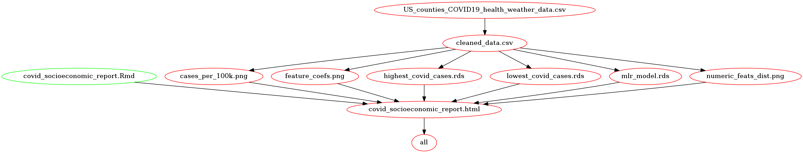

# U.S. Social Determinants of Health per County

Authors: Joshua Sia, Morgan Rosenberg, Sufang Tan, Yinan Guo \[Group
25\]

Data analysis project for DSCI 522 (Data Science Workflows); a course in
the Master of Data Science program at the University of British
Columbia.

## **About**

COVID-19 is a serious pandemic that has introduced a wide variety of challenges since 2019. By analysing the association of certain socioeconomic factors with COVID-19 prevalence, we hope to shed some light onto the societal features that may be associated with a high number of COVID-19 cases. Identifying the socioeconomic factors could also help policymakers and leaders make more informed decisions in combatting COVID-19.

Here, we attempt to build a multiple linear regression model which is used to quantify the influence of socioeconomic factors on the COVID-19 prevalence (measured by cases per 100,000 population) among all US counties. Factors such as percentage of smokers, income ratio, population density, percent unemployed, etc. are explored. Our final regression model suggests that the percentage of smokers, teenage birth rates, and chlamydia rates are the three features more strongly associated with COVID-19 prevalence. However, the original data set contained over 200 features and a subset of these features were chosen arbitrarily which means that there is still room to explore other socioeconomic features that are significantly associated with COVID-19 prevalence.

## **Report**

The final report can be found [here](https://github.com/UBC-MDS/DSCI_522_US_social_determinants_of_health_by_county/blob/main/doc/covid_socioeconomic_report.md). The final report can also be downloaded as a html file [here](https://github.com/UBC-MDS/DSCI_522_US_social_determinants_of_health_by_county/blob/main/doc/covid_socioeconomic_report.html). A preview of the final report as a html file can be viewed [here](https://ubc-mds.github.io/DSCI_522_US_social_determinants_of_health_by_county/doc/covid_socioeconomic_report.html).

## Usage

To replicate the analysis, please have a `kaggle.json` file containing your Kaggle credentials. To obtain your Kaggle credentials, follow the instructions on [Kaggle](https://www.kaggle.com/docs/api). Next, clone this GitHub repository, install the
dependencies listed below, and run the following
commands at the command line/terminal from the root directory of this
project:

    make all
    
To reset the repo to a clean state, with no intermediate or results files, run the following command at the command line/terminal from the root directory of this project:

    make clean
    
Alternatively, the scripts can be specified and run individually as:
    
    # Download data file
    Rscript src/get_kaggle_data.R --url=https://www.kaggle.com/johnjdavisiv/us-counties-covid19-weather-sociohealth-data --file=US_counties_COVID19_health_weather_data.csv --out_file=data/raw/US_counties_COVID19_health_weather_data.csv

    # Perform data wrangling
    Rscript src/data_wrangling.r --input=data/raw/US_counties_COVID19_health_weather_data.csv --output=data/processed

    # EDA
    Rscript src/eda_covid_socioeconomics.r --in_file=data/processed/cleaned_data.csv --out_dir=results

    # Perform data analysis
    Rscript src/analyse_socioeconomic_features.R --in_file=data/processed/cleaned_data.csv --out_dir=results

    # Render report
    Rscript -e "rmarkdown::render('doc/covid_socioeconomic_report.Rmd')"

The dependency diagram of the Makefile is shown below.

## **Dependencies**
-   R version 4.1.1 and R packages:
    -   docopt=0.7.1
    -   tidyverse=1.3.1
    -   httr=1.4.2
    -   jsonlite=1.7.2
    -   broom=0.7.9
    -   plotly=4.10.0
    -   here=1.0.1
    -   knitr=1.33
    -   testthat=3.0.4

## License:

The US social determinants of health by county data set is licensed under CC0 Public Domain.

## References
Davis, J. (2020, December 5). US social determinants of health by county. Kaggle. Retrieved December 2, 2021, from https://www.kaggle.com/johnjdavisiv/us-counties-covid19-weather-sociohealth-data. 
