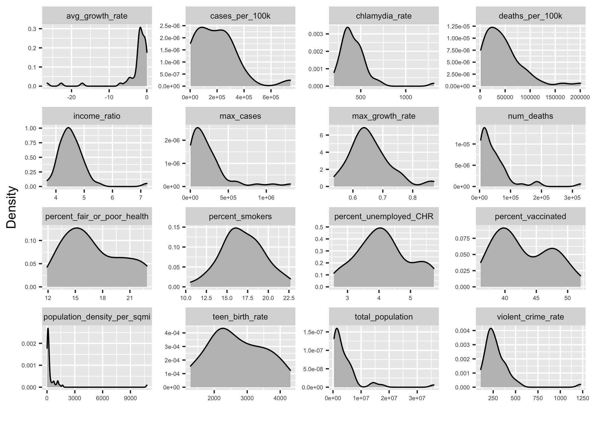
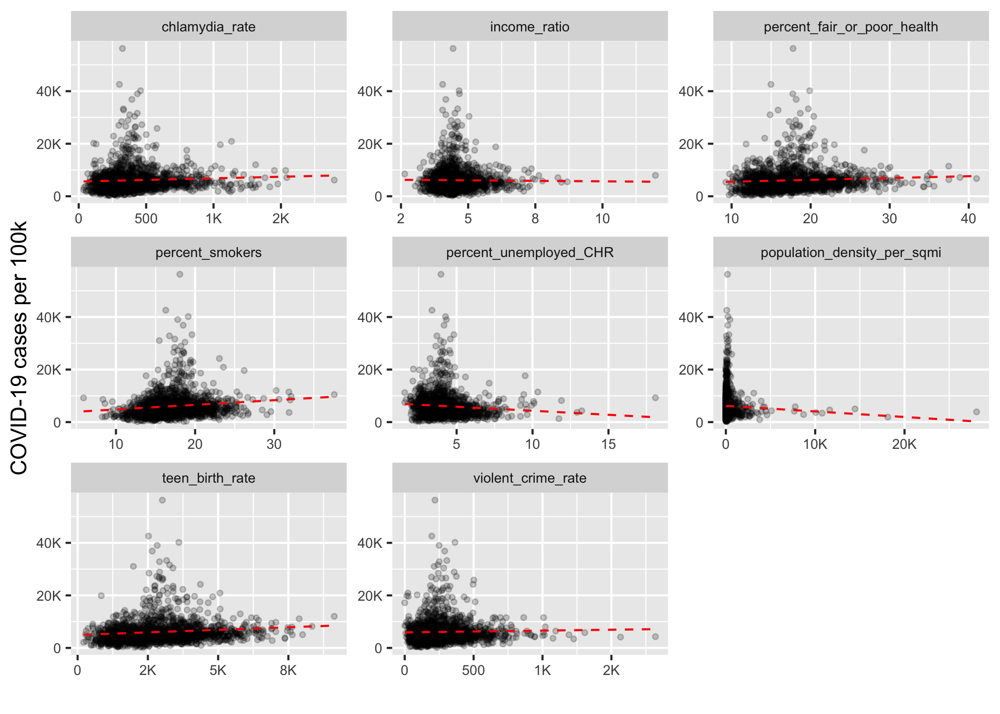
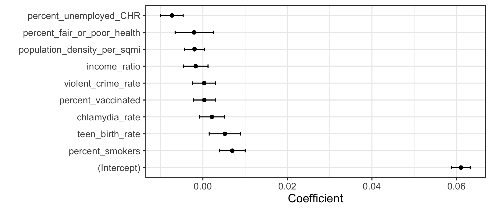

```{r setup, include=FALSE}
knitr::opts_chunk$set(echo = FALSE)
library(knitr)
library(docopt)
library(tidyverse)
library(plotly)
library(broom)
library(testthat)
library(here)
```

```{r load model results}
mlr_model <- readRDS(here("results", "mlr_model.rds"))
highest_covid_cases <- readRDS(here("results", "highest_covid_cases.rds"))
lowest_covid_cases <- readRDS(here("results", "lowest_covid_cases.rds"))
```

# Summary

Here, we attempt to build a multiple linear regression model which is used to quantify the influence of socioeconomic factors on the COVID-19 prevalence (measured by cases per 100,000 population) among all US counties. Factors such as percentage of smokers, income ratio, population density, percent unemployed, etc. are explored. Our final regression model suggests that the percentage of smokers, teenage birth rates, unemployment rate, and a few interaction terms are significantly associated with COVID-19 prevalence at the 0.05 level. However, the original data set contained over 200 features and a subset of these features were chosen arbitrarily which means that there is still room to explore other socioeconomic features that are significantly associated with COVID-19 prevalence.

# Introduction

COVID-19 is a serious pandemic that has introduced a wide variety of challenges since 2019. By analysing the association of certain socioeconomic factors with COVID-19 prevalence, we hope to shed some light onto the societal features that may be associated with a high number of COVID-19 cases. Identifying the socioeconomic factors could also help policymakers and leaders make more informed decisions in combating COVID-19.

# Methods

## Data

The original data set used in this project is of US social determinants of health by county created by Dr. John Davis at Indiana University, the United States. Each row in the original data set represents a day for a county with the cumulative number of COVID-19 cases, and other socioeconomic features of the county. There are over 790,000 rows and over 200 features in the data set. We identified a subset of these features which we were interested in and also added a few "wildcard" features such as the teen birth rate and chlamydia rate which might be related to broader social determinants of public health. In the future, additional features could be chosen as they become of interest to the team, or are requested by the community.

The data set reports time series data per county for the cumulative COVID-19 cases and different socioeconomic features. However, due to limits in measurements and reporting, COVID-19 cases and socioeconomic features were updated at irregular intervals (e.g. COVID-19 cases were reported daily, whereas the socioeconomic features were reported no more than once a month). Thus, we created summary statistics for the socioeconomic features per county such as the mean percentage of smokers.

The processed data contains 1621 observations and 18 features where each row corresponds to the cumulative COVID-19 cases, and aggregated socioeconomic features for each county. All missing values were removed during data wrangling.

## Analysis

A multiple linear regression model with interaction terms was used to quantify the association of the socioeconomic features with COVID-19 prevalence. The R programming language [@R] and the following R packages were used to perform the analysis: broom [@broom], docopt [@docopt], knitr [@knitr], tidyverse [@tidyverse], testhat[@testhat], and here [@here]. The code used to perform the analysis and create this report can be found [here](https://github.com/UBC-MDS/DSCI_522_US_social_determinants_of_health_by_county).

In terms of feature transformation, there were no missing values in the processed data set and thus, imputation was not required. Furthermore, for all the numeric variables, scaling was performed such that the feature has a mean of zero, and a standard deviation of 1. Interaction terms were included in the model to account for non-linear relationships between COVID-19 prevalence and the features.

# Results

## Exploratory Data Analysis (EDA)

Exploratory data analysis was first carried out to determine the distributions of data, as well as to get early hints into how certain socioeconomic features might be associated with COVID-19 prevalence. First, we create a summary table to check COVID-19 prevalence for each county.

### COVID-19 prevalence for every county

```{r table of covid prevalence for each county, message=FALSE}
kable(highest_covid_cases,
      caption = "Table 5. Top 6 counties with highest number of cumulative COVID-19 cases.",
      digits = 3)

kable(lowest_covid_cases,
      caption = "Table 6. Top 6 counties with lowest number of cumulative COVID-19 cases",
      digits = 3)
```

### Distributions of numeric features

Density plots for all numeric variables are also created to check their distributions. The is a positive skew for many of the variables.

```{r density plots for numeric variables, warning=FALSE, fig.cap="Figure 1. Density plots of numeric features", out.width="100%"}

```

### Relationships between cumulative COVID-19 cases per 100,000 of each county and socioeconomic features

Plots to demonstrate the relationship between COVID-19 cases per 100,000 and socioeconomic features are created for each county. The linear relationships are not strong individually, however, this could be because each feature is observed in isolation. There might be interactions between these features which can have a linear relationship with COVID-19 prevalence.

```{r cases per 100k vs other features, warning=FALSE, fig.cap="Figure 2. Plots of COVID-19 cases per 100,000 against features", out.width="100%"}

```

## Multiple linear regression model

There are 45 features including all the interaction terms. A subset of 10 features are selected randomly and their corresponding coefficient estimates, p-values and whether they are significant at the 0.05 level are shown.

```{r model coefs table, warning=FALSE}
kable(mlr_model, caption = "Table 9. Coefficients of some features of the multiple linear regression model.")
```

### Coefficients of significant feature of the multiple linear regression model with 95% confidence intervals

The coefficients along with their 95% confidence intervals are plotted as error bars for features that were significant at the 0.05 level.

```{r model coefs figure, warning=FALSE, fig.cap="Figure 4. Coefficients of significant features of MLR with 95% confidence intervals.", out.width="100%"}

```

# Discussion

The multiple linear regression result reveals that 7 features and the intercept term are statistically significant at the 5% significance level. Some of the significant features such as the percentage of smokers make sense, however, there are also some features that are unexpected, such as the teen birth rate. Interestingly, features also seem to interact with one another to become significant, such as the interaction between violent crime rate and chlamydia rate. One possible explanation for significance is that these features hint at larger socioeconomic problems that are difficult to measure and quantify.

To further improve our model in the future, techniques such as PCA, feature engineering, and feature selection can be implemented to select features in a more robust method. Other non-linear models such as a random forest can also be used and compared to see if the feature importances are similar or not.

# References
