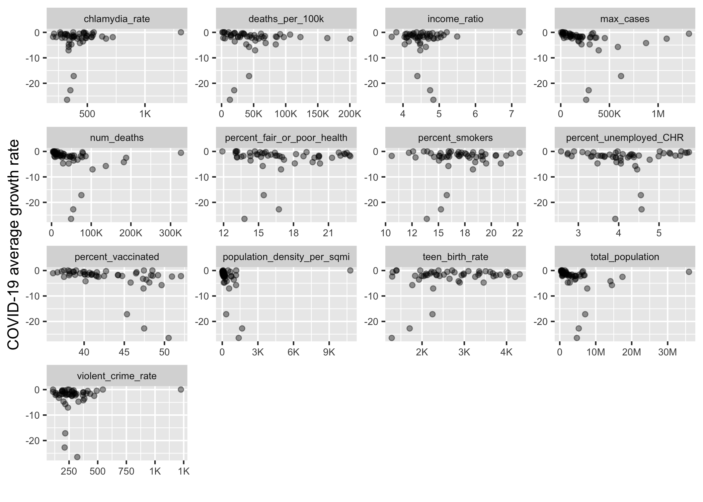

Report for US social determinants of health by county dataset
================
Joshua Sia, Morgan Rosenberg, Sufang Tan, Yinan Guo (Group 25)  
2021/11/27

-   [Setup](#setup)
-   [Summary](#summary)
-   [Introduction](#introduction)
-   [Methods](#methods)
    -   [Data](#data)
    -   [Analysis](#analysis)
-   [Results & Discussion](#results--discussion)
    -   [Exploratory Data Analysis
        (EDA)](#exploratory-data-analysis-eda)
    -   [Data Analysis (Modeling)](#data-analysis-modeling)
    -   [References](#references)

# Setup

Our GitHub Repo:
<a href="https://github.com/UBC-MDS/DSCI_522_US_social_determinants_of_health_by_county" class="uri"><strong><https://github.com/UBC-MDS/DSCI_522_US_social_determinants_of_health_by_county></strong></a>

# Summary

Here we attempt to build a Multiple Linear Regression model which can
use to quantify the influence of potential factors on the COVID-19
prevalence (measured by cases per 100k population) among all the US
counties. Our final regression model suggests that the percentage of
smokers, teenage birth rate and chlamydia rate are the three features
most strongly associated with COVID-19 prevalence. However, the
intercept term is the one with the largest value. This means there are
other unobserved factors weighted significantly in explaining the
COVID-19 prevalence, thus we should continue the study to find and
include those potential factors from 200 variables in the original
dataset to improve the explanation of COVID-19 prevalence.

# Introduction

The original data set contained over 200 features with a high degree of
granularity to support different exploratory questions. We identified a
subset of these features whose relationship to COVID-19 prevalence we
believed to be of interest to the general population based on intuition
and validated by a media scan. We also added a few “wildcard” features
(“chlamydia” and “teen birth rate”) which might be related to broader
social determinants of public health. In the future, we might choose to
add additional features as they are requested by the community or become
of interest to the team.

In addition, our original data reported observations as a time series
per county. However, due to limits in measurement and reporting, their
was a varied rate of change for different features (e.g.COVID-19 cases
were reported daily, whereas many other features were reported no more
than once per month). As such, we believe it is most effective to
summarize the data into static summary measures per county. In the
processed data, we normalized the teen birth rate by per thousand
females, and all other rates are by per 100k people.

Each row in the processed data set contains normalized COVID-19 related
features and other normalized demographic statistics for each county.
There are 1621 observations in the data set, and 18 features. There are
0 observations with missing values in the data set. Below we show the
descriptive statistics of the dataset.

# Methods

## Data

The original data set used in this project is of US social determinants
of health by county created by Dr. John Davis at Indiana University, the
United States. Each row in the original data set represents a day with
its corresponding COVID-19 cases (accumulated), number of deaths due to
COVID-19 (accumulated), and other demographic statistics.

## Analysis

The Multiple Linear Regression was used to quantify the influence of
potential factors we chosen on the COVID-19 prevalence (measured by
cases per 100k population) among all the US counties. All variables
included in the original data set, The R programming languages \[@R\]
and the following R packages were used to perform the analysis:broom
\[@broom\], docopt \[@docopt\], knitr \[@knitr\], tidyverse
\[@tidyverse\], testhat\[@testhat\], here \[@here\]. The code used to
perform the analysis and create this report can be found here:
<https://github.com/UBC-MDS/DSCI_522_US_social_determinants_of_health_by_county>.

# Results & Discussion

## Exploratory Data Analysis (EDA)

To look at whether each of the features might be useful to determine the
change of COVID-19 cases, we first created two summary tables to check
COVID-19 prevalence for each state and for each county.

### Table of COVID-19 prevalence for every county

| county        | state      | max_cases | cases_per_100k | avg_growth_rate | max_growth_rate |
|:--------------|:-----------|----------:|---------------:|----------------:|----------------:|
| Los Angeles   | California |    430713 |       4282.652 |       0.0350836 |       0.8571429 |
| New York City | New York   |    329406 |       3892.786 |       0.0373151 |       0.5833333 |
| Cook          | Illinois   |    322122 |      11008.466 |    -379.1270985 |       0.9998757 |
| Miami-Dade    | Florida    |    238812 |       8963.008 |       0.0390208 |       0.7500000 |
| Maricopa      | Arizona    |    224924 |       5501.316 |       0.0347391 |       0.5000000 |
| Harris        | Texas      |    195558 |       8472.749 |     -66.2769127 |       0.9964581 |

Table 5. Top 5 counties with highest maximum number of COVID-19 cases.

|      | county      | state    | max_cases | cases_per_100k | avg_growth_rate | max_growth_rate |
|:-----|:------------|:---------|----------:|---------------:|----------------:|----------------:|
| 1616 | Norton city | Virginia |        91 |      2287.5817 |       0.0149803 |       0.5000000 |
| 1617 | Glascock    | Georgia  |        86 |      2816.9014 |       0.0182532 |       0.5000000 |
| 1618 | Upton       | Texas    |        84 |      2417.2662 |       0.0209599 |       0.5000000 |
| 1619 | Baylor      | Texas    |        57 |      1566.3644 |       0.0054022 |       0.5000000 |
| 1620 | Piscataquis | Maine    |        57 |       334.4285 |       0.0134190 |       0.5000000 |
| 1621 | Grand Isle  | Vermont  |        46 |       662.3470 |       0.0132021 |       0.6666667 |

Table 6. Top 5 counties with lowest maximum number of COVID-19 cases

### Table of COVID-19 prevalence for every state

| state      | max_cases | cases_per_100k | avg_growth_rate | max_growth_rate |
|:-----------|----------:|---------------:|----------------:|----------------:|
| California |   1316934 |       178169.7 |      -0.5259852 |       0.6446646 |
| Texas      |   1088014 |       735038.7 |      -2.4912836 |       0.6218917 |
| Florida    |    876362 |       306312.7 |      -4.1977126 |       0.6667161 |
| Illinois   |    619604 |       253432.4 |     -17.1581650 |       0.6968899 |
| New York   |    586878 |       113808.1 |      -5.7251701 |       0.7163069 |
| Georgia    |    452834 |       743968.0 |      -2.2504604 |       0.7116388 |

Table 7. Top 5 states with highest maximum number of COVID-19 cases.

|     | state                | max_cases | cases_per_100k | avg_growth_rate | max_growth_rate |
|:----|:---------------------|----------:|---------------:|----------------:|----------------:|
| 46  | District of Columbia |     22480 |       3411.183 |       0.0308881 |       0.7500000 |
| 47  | Maine                |     20279 |      31187.580 |      -1.2307740 |       0.6736190 |
| 48  | Alaska               |     19082 |      12589.425 |       0.0239296 |       0.5367647 |
| 49  | Hawaii               |     18373 |       3157.336 |       0.0232393 |       0.5530303 |
| 50  | New Hampshire        |     12374 |      10509.595 |      -0.6624274 |       0.6426744 |
| 51  | Vermont              |      3256 |       5541.161 |       0.0169872 |       0.5543210 |

Table 8. Top 5 states with lowest maximum number of COVID-19 cases.

### Visualization 1 - distributions of numeric features

Then we created density plots for all numeric variables to check the
distributions. From the density plots, we can see a right skew for many
variables.

### Visualization 2 - relationships between total COVID-19 cases per 100k of each state and other features

In addition, we created plots to demonstrate relationships between
COVID-19 cases per 100k of each state and other features in the dataset.
We can observe linear relationships between income ratio,
percent_fair_poor_health, and percent_smokers with cases per 100k.
Although all of the relationships are not strong.

### Visualization 3 - relationships between average COVID-19 cases growth rate for each state and other features

We also created plots to demonstrate relationships between average
COVID-19 cases growth rate of each state and other features in the
dataset. We can see that there is no clear relationships for COVID-19
growth rate.

## Data Analysis (Modeling)

The results of data analysis:

| term                        |   estimate |  conf.low |  conf.high |   p.value | is_sig |
|:----------------------------|-----------:|----------:|-----------:|----------:|:-------|
| (Intercept)                 | 6103.88512 | 5883.1955 | 6324.57474 | 0.0000000 | TRUE   |
| percent_smokers             |  694.90576 |  387.9913 | 1001.82019 | 0.0000096 | TRUE   |
| teen_birth_rate             |  521.14262 |  148.6937 |  893.59149 | 0.0061274 | TRUE   |
| chlamydia_rate              |  214.30427 |  -80.1007 |  508.70925 | 0.1535501 | FALSE  |
| percent_vaccinated          |   32.98412 | -225.3009 |  291.26918 | 0.8022450 | FALSE  |
| violent_crime_rate          |   29.41014 | -244.5508 |  303.37113 | 0.8332546 | FALSE  |
| income_ratio                | -168.86961 | -459.2280 |  121.48876 | 0.2541422 | FALSE  |
| population_density_per_sqmi | -197.47020 | -436.7978 |   41.85743 | 0.1057743 | FALSE  |
| percent_fair_or_poor_health | -205.36215 | -656.1671 |  245.44281 | 0.3717101 | FALSE  |
| percent_unemployed_CHR      | -731.93358 | -996.1554 | -467.71180 | 0.0000001 | TRUE   |

Table 9. Coefficients of each feature of the multiple linear regression
model.

### Visualization 4 - Coefficients of each feature of the multiple linear regression model with 95% confidence intervals.

The multiple linear regression result reveals that only three features
and the intercept term are statistically significant on 5% significant
level. After normalizing all features, the value of the intercept term
is larger than the sum of the absolute coefficient of all other
significant features. This means our current model has low explanatory
power on the responsive variable COVID-19 cases, which enables the
intercept term to capture most of the changes. To further improve this
model in future with hopes of finding the essential influence factors of
COVID-19 prevalence, we need to improve our feature selecting process by
using methods like PCA model and incorporating advanced feature
engineering techniques.

## References
