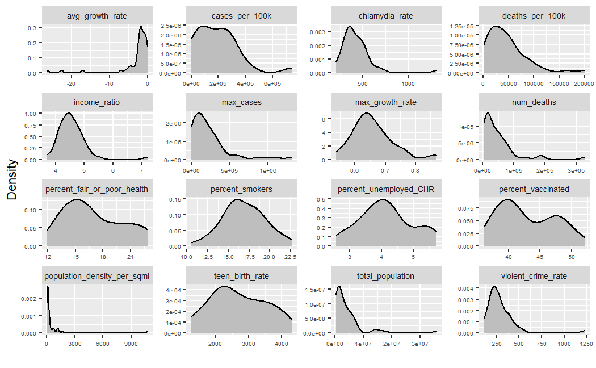
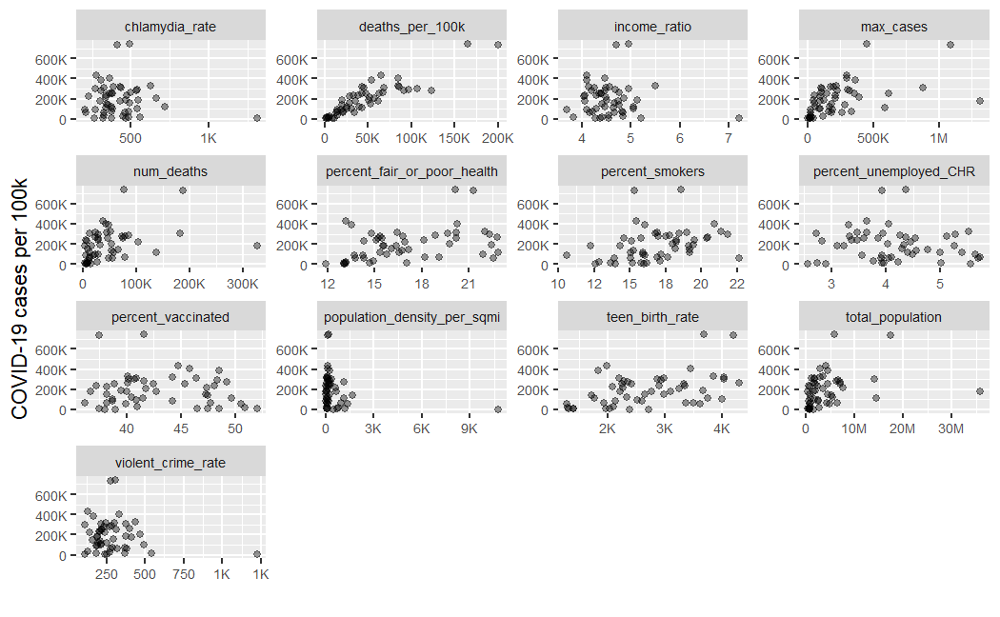
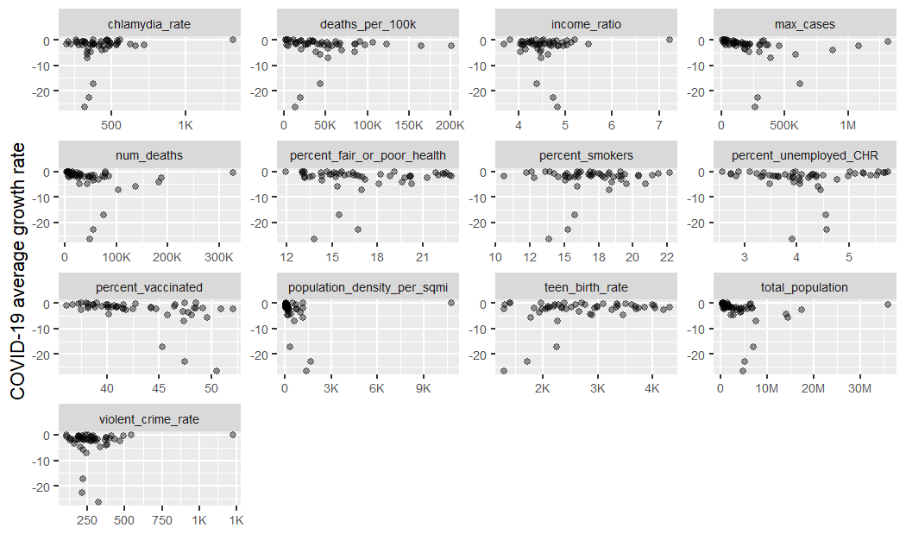

## Setup

``` r
library(tidyverse)
library(plotly)
library(broom)
library(knitr)
```

Our GitHub Repo:
<a href="https://github.com/UBC-MDS/DSCI_522_US_social_determinants_of_health_by_county" class="uri"><strong>https://github.com/UBC-MDS/DSCI_522_US_social_determinants_of_health_by_county</strong></a>

## Load Data

``` r
covid_data <- read.csv('data/processed/cleaned_data.csv')
  
n_nas <- nrow(covid_data) - (drop_na(covid_data) %>% tally())
```

The original data set used in this project is of US social determinants
of health by county created by Dr. John Davis at Indiana University, the
United States (Davis 2020). Each row in the original data set represents
a day with its corresponding COVID-19 cases (accumulated), number of
deaths due to COVID-19 (accumulated), and other demographic statistics.

The original data set contained over 200 features with a high degree of
granularity to support different exploratory questions. We identified a
subset of these features whose relationship to COVID-19 prevalence we
believed to be of interest to the general population based on intuition
and validated by a media scan. We also added a few “wildcard” features
(“chlamydia” and “teen birth rate”) which might be related to broader
social determinants of public health. In the future, we might choose to
add additional features as they are requested by the community or become
of interest to the team.

In addition, our original data reported observations as a time series
per county. However, due to limits in measurement and reporting, their
was a varied rate of change for different features (e.g. COVID-19 cases
were reported daily, whereas many other features were reported no more
than once per month). As such, we believe it is most effective to
summarize the data into static summary measures per county. In the
processed data, we normalized the teen birth rate by per thousand
females, and all other rates are by per 100k people.

Each row in the processed data set contains normalized COVID-19 related
features and other normalized demographic statistics for each county.
There are 1621 observations in the data set, and 18 features. There are
0 observations with missing values in the data set. Below we show the
descriptive statistics of the dataset.

## Descriptive Statistics

Here we demonstrated

-   the internal structure of the dataset;
-   summary data related to the individual features;
-   the top of the dataset;
-   the bottom of the dataset; and
-   the number of unique values in each feature.

``` r
str(covid_data)
```

    ## 'data.frame':    1621 obs. of  19 variables:
    ##  $ county                     : chr  "Abbeville" "Acadia" "Accomack" "Ada" ...
    ##  $ state                      : chr  "South Carolina" "Louisiana" "Virginia" "Idaho" ...
    ##  $ max_cases                  : int  1002 4197 1367 27461 1294 31594 195 6665 810 13190 ...
    ##  $ avg_growth_rate            : num  0.023 0.0269 0.0239 0.0336 -2.7802 ...
    ##  $ max_growth_rate            : num  0.667 0.718 0.5 0.636 0.988 ...
    ##  $ total_population           : num  24951 62372 33060 425798 18468 ...
    ##  $ num_deaths                 : num  430 1027 600 3940 287 ...
    ##  $ percent_smokers            : num  17.3 21.5 18.3 12 21.6 ...
    ##  $ percent_vaccinated         : num  29 48 44 48 45.5 ...
    ##  $ income_ratio               : num  5.22 5.8 4.16 4.48 5.05 ...
    ##  $ population_density_per_sqmi: num  50.9 95.2 73.6 404.6 35.7 ...
    ##  $ percent_fair_or_poor_health: num  19.9 20.9 20.1 11.5 21.6 ...
    ##  $ percent_unemployed_CHR     : num  3.98 5.37 3.81 2.46 3.76 ...
    ##  $ violent_crime_rate         : num  341 443 226 231 212 ...
    ##  $ chlamydia_rate             : num  647 577 648 449 393 ...
    ##  $ teen_birth_rate            : num  2848 4734 3105 1308 2762 ...
    ##  $ total_cases                : num  4016 6729 4135 6449 7007 ...
    ##  $ deaths_per_100k            : num  1723 1647 1815 925 1553 ...
    ##  $ cases_per_100k             : num  4016 6729 4135 6449 7007 ...

``` r
kable(summary(covid_data))
```

|     | county           | state            | max_cases     | avg_growth_rate | max_growth_rate | total_population | num_deaths    | percent_smokers | percent_vaccinated | income_ratio   | population_density_per_sqmi | percent_fair_or_poor_health | percent_unemployed_CHR | violent_crime_rate | chlamydia_rate | teen_birth_rate | total_cases     | deaths_per_100k | cases_per_100k  |
|:----|:-----------------|:-----------------|:--------------|:----------------|:----------------|:-----------------|:--------------|:----------------|:-------------------|:---------------|:----------------------------|:----------------------------|:-----------------------|:-------------------|:---------------|:----------------|:----------------|:----------------|:----------------|
|     | Length:1621      | Length:1621      | Min. : 46     | Min. :-379.1271 | Min. :0.2000    | Min. : 2083      | Min. : 32     | Min. : 5.909    | Min. : 7.00        | Min. : 2.638   | Min. : 0.712                | Min. : 9.275                | Min. : 1.582           | Min. : 0.0         | Min. : 35.8    | Min. : 210.9    | Min. : 170.3    | Min. : 465.1    | Min. : 170.3    |
|     | Class :character | Class :character | 1st Qu.: 764  | 1st Qu.: 0.0174 | 1st Qu.:0.5000  | 1st Qu.: 17324   | 1st Qu.: 265  | 1st Qu.:15.108  | 1st Qu.:38.00      | 1st Qu.: 4.085 | 1st Qu.: 25.577             | 1st Qu.:14.743              | 1st Qu.: 3.305         | 1st Qu.: 144.8     | 1st Qu.: 254.2 | 1st Qu.:2001.3  | 1st Qu.: 3472.1 | 1st Qu.:1179.9  | 1st Qu.: 3472.1 |
|     | Mode :character  | Mode :character  | Median : 1966 | Median : 0.0239 | Median :0.6000  | Median : 38488   | Median : 568  | Median :17.133  | Median :44.00      | Median : 4.438 | Median : 61.897             | Median :17.443              | Median : 3.961         | Median : 230.4     | Median : 358.6 | Median :2812.2  | Median : 5126.8 | Median :1433.9  | Median : 5126.8 |
|     | NA               | NA               | Mean : 7279   | Mean : -2.7989  | Mean :0.6517    | Mean : 130794    | Mean : 1512   | Mean :17.344    | Mean :42.71        | Mean : 4.550   | Mean : 292.342              | Mean :17.996                | Mean : 4.170           | Mean : 269.0       | Mean : 411.5   | Mean :2969.0    | Mean : 6104.9   | Mean :1464.2    | Mean : 6104.9   |
|     | NA               | NA               | 3rd Qu.: 5723 | 3rd Qu.: 0.0274 | 3rd Qu.:0.8000  | 3rd Qu.: 98673   | 3rd Qu.: 1320 | 3rd Qu.:19.316  | 3rd Qu.:49.00      | 3rd Qu.: 4.869 | 3rd Qu.: 163.663            | 3rd Qu.:20.678              | 3rd Qu.: 4.766         | 3rd Qu.: 349.5     | 3rd Qu.: 511.6 | 3rd Qu.:3768.1  | 3rd Qu.: 7161.6 | 3rd Qu.:1720.8  | 3rd Qu.: 7161.6 |
|     | NA               | NA               | Max. :430713  | Max. : 0.0390   | Max. :0.9999    | Max. :10057155   | Max. :84296   | Max. :37.579    | Max. :66.00        | Max. :11.971   | Max. :28069.676             | Max. :40.991                | Max. :18.092           | Max. :1819.5       | Max. :1895.5   | Max. :9132.9    | Max. :56251.5   | Max. :3183.1    | Max. :56251.5   |

``` r
kable(head(covid_data))
```

| county    | state          | max_cases | avg_growth_rate | max_growth_rate | total_population | num_deaths | percent_smokers | percent_vaccinated | income_ratio | population_density_per_sqmi | percent_fair_or_poor_health | percent_unemployed_CHR | violent_crime_rate | chlamydia_rate | teen_birth_rate | total_cases | deaths_per_100k | cases_per_100k |
|:----------|:---------------|----------:|----------------:|----------------:|-----------------:|-----------:|----------------:|-------------------:|-------------:|----------------------------:|----------------------------:|-----------------------:|-------------------:|---------------:|----------------:|------------:|----------------:|---------------:|
| Abbeville | South Carolina |      1002 |       0.0229577 |       0.6666667 |         24951.00 |   430.0000 |        17.32352 |           29.00000 |     5.219207 |                    50.87034 |                    19.89504 |               3.976934 |           341.1931 |       647.2000 |        2848.211 |    4015.871 |       1723.3778 |       4015.871 |
| Acadia    | Louisiana      |      4197 |       0.0268592 |       0.7179487 |         62372.00 |  1027.0000 |        21.53409 |           48.00000 |     5.804627 |                    95.20564 |                    20.89004 |               5.373246 |           443.4069 |       576.8000 |        4733.896 |    6728.981 |       1646.5722 |       6728.981 |
| Accomack  | Virginia       |      1367 |       0.0238804 |       0.5000000 |         33060.00 |   600.0000 |        18.31693 |           44.00000 |     4.160476 |                    73.57990 |                    20.08920 |               3.812194 |           225.8680 |       648.3000 |        3104.832 |    4134.906 |       1814.8820 |       4134.906 |
| Ada       | Idaho          |     27461 |       0.0335827 |       0.6363636 |        425798.00 |  3940.0000 |        11.99070 |           48.00000 |     4.478032 |                   404.55146 |                    11.47488 |               2.459871 |           230.6335 |       448.7000 |        1308.355 |    6449.302 |        925.3214 |       6449.302 |
| Adair     | Iowa           |      1294 |      -2.7801822 |       0.9879518 |         18467.60 |   286.8548 |        21.55887 |           45.52895 |     5.050669 |                    35.66845 |                    21.58778 |               3.757364 |           212.1026 |       392.8401 |        2761.632 |    7006.865 |       1553.2863 |       7006.865 |
| Adams     | Colorado       |     31594 |      -5.7408231 |       0.9988620 |         99964.39 |  1140.8011 |        17.43496 |           44.76759 |     4.506176 |                   114.79119 |                    18.68980 |               4.583603 |           240.4581 |       434.3257 |        3272.239 |   31605.256 |       1141.2075 |      31605.256 |

``` r
kable(tail(covid_data))
```

|      | county  | state        | max_cases | avg_growth_rate | max_growth_rate | total_population | num_deaths | percent_smokers | percent_vaccinated | income_ratio | population_density_per_sqmi | percent_fair_or_poor_health | percent_unemployed_CHR | violent_crime_rate | chlamydia_rate | teen_birth_rate | total_cases | deaths_per_100k | cases_per_100k |
|:-----|:--------|:-------------|----------:|----------------:|----------------:|-----------------:|-----------:|----------------:|-------------------:|-------------:|----------------------------:|----------------------------:|-----------------------:|-------------------:|---------------:|----------------:|------------:|----------------:|---------------:|
| 1616 | Young   | Texas        |       977 |       0.0237129 |       0.6666667 |            18275 |     342.00 |        15.94356 |           38.00000 |     4.157615 |                   19.984283 |                    18.09056 |               3.236839 |          169.44520 |       200.2000 |        4787.666 |    5346.101 |       1871.4090 |       5346.101 |
| 1617 | Yuba    | California   |      2403 |       0.0255391 |       0.5000000 |            73897 |    1164.00 |        14.17914 |           40.00000 |     4.603198 |                  116.918634 |                    16.39254 |               6.406906 |          413.72712 |       398.5000 |        3080.498 |    3251.823 |       1575.1654 |       3251.823 |
| 1618 | Yuma    | Colorado     |     18762 |     -43.1925404 |       0.9948630 |           106351 |    1040.36 |        13.80424 |           26.45211 |     4.239954 |                   20.518103 |                    18.98300 |               9.509770 |          167.04944 |       373.7234 |        3566.269 |   17641.584 |        978.2326 |      17641.584 |
| 1619 | Zapata  | Texas        |       548 |       0.0226051 |       0.6666667 |            14335 |     158.00 |        17.27549 |           32.00000 |     5.416122 |                   14.357800 |                    35.61071 |               5.561756 |           96.04171 |       251.4000 |        7378.882 |    3822.811 |       1102.1974 |       3822.811 |
| 1620 | Zavala  | Texas        |       816 |       0.0237404 |       0.7142857 |            12107 |     169.00 |        19.87128 |           26.00000 |     5.051775 |                    9.331695 |                    40.99069 |               9.546340 |          176.55367 |        83.7000 |        6439.283 |    6739.903 |       1395.8867 |       6739.903 |
| 1621 | Ziebach | South Dakota |       237 |       0.0173153 |       0.6969697 |             2818 |      32.00 |        32.02117 |           19.00000 |     5.319645 |                    1.436850 |                    29.16651 |               5.144694 |            0.00000 |       870.8000 |        2966.102 |    8410.220 |       1135.5571 |       8410.220 |

``` r
apply(covid_data, 2, function(x) length(unique(x)))
```

    ##                      county                       state 
    ##                        1621                          51 
    ##                   max_cases             avg_growth_rate 
    ##                        1437                        1621 
    ##             max_growth_rate            total_population 
    ##                         399                        1612 
    ##                  num_deaths             percent_smokers 
    ##                        1248                        1621 
    ##          percent_vaccinated                income_ratio 
    ##                         414                        1620 
    ## population_density_per_sqmi percent_fair_or_poor_health 
    ##                        1621                        1621 
    ##      percent_unemployed_CHR          violent_crime_rate 
    ##                        1620                        1620 
    ##              chlamydia_rate             teen_birth_rate 
    ##                        1510                        1618 
    ##                 total_cases             deaths_per_100k 
    ##                        1621                        1621 
    ##              cases_per_100k 
    ##                        1621

## Exploratory Data Analysis (EDA)

To look at whether each of the features might be useful to determine the
change of COVID-19 cases, we first created two summary tables to check
COVID-19 prevalence for each state and for each county.

### Table of COVID-19 prevalence for every county

``` r
covid_prevalence_table_county <- covid_data %>%
  select(county, 
         state, 
         max_cases, 
         cases_per_100k, 
         avg_growth_rate, 
         max_growth_rate) %>%
  arrange(desc(max_cases)) 


kable(head(data.frame(covid_prevalence_table_county)), 
      caption = "Table 1. Top 5 counties with highest COVID-19 growth rate.")
```

| county        | state      | max_cases | cases_per_100k | avg_growth_rate | max_growth_rate |
|:--------------|:-----------|----------:|---------------:|----------------:|----------------:|
| Los Angeles   | California |    430713 |       4282.653 |       0.0350836 |       0.8571429 |
| New York City | New York   |    329406 |       3892.786 |       0.0373151 |       0.5833333 |
| Cook          | Illinois   |    322122 |      11008.466 |    -379.1270985 |       0.9998757 |
| Miami-Dade    | Florida    |    238812 |       8963.008 |       0.0390208 |       0.7500000 |
| Maricopa      | Arizona    |    224924 |       5501.316 |       0.0347391 |       0.5000000 |
| Harris        | Texas      |    195558 |       8472.749 |     -66.2769127 |       0.9964581 |

Table 1. Top 5 counties with highest COVID-19 growth rate.

``` r
kable(tail(data.frame(covid_prevalence_table_county)), 
      caption = "Table 2. Top 5 counties with lowest COVID-19 growth rate.")
```

|      | county      | state    | max_cases | cases_per_100k | avg_growth_rate | max_growth_rate |
|:-----|:------------|:---------|----------:|---------------:|----------------:|----------------:|
| 1616 | Norton city | Virginia |        91 |      2287.5817 |       0.0149803 |       0.5000000 |
| 1617 | Glascock    | Georgia  |        86 |      2816.9014 |       0.0182532 |       0.5000000 |
| 1618 | Upton       | Texas    |        84 |      2417.2662 |       0.0209599 |       0.5000000 |
| 1619 | Baylor      | Texas    |        57 |      1566.3644 |       0.0054022 |       0.5000000 |
| 1620 | Piscataquis | Maine    |        57 |       334.4285 |       0.0134190 |       0.5000000 |
| 1621 | Grand Isle  | Vermont  |        46 |       662.3470 |       0.0132021 |       0.6666667 |

Table 2. Top 5 counties with lowest COVID-19 growth rate.

### Table of COVID-19 prevalence for every state

``` r
covid_prevalence_table_state <- covid_data %>%
  group_by(state) %>%
  summarize(max_cases = sum(max_cases),
  cases_per_100k = sum(cases_per_100k, na.rm=TRUE),
  avg_growth_rate = mean(avg_growth_rate, na.rm=TRUE), 
  max_growth_rate = mean(max_growth_rate)) %>%
  arrange(desc(max_cases)) 

kable(head(data.frame(covid_prevalence_table_state)), 
      caption = "Table 3. Top 5 states with highest COVID-19 growth rate.")
```

| state      | max_cases | cases_per_100k | avg_growth_rate | max_growth_rate |
|:-----------|----------:|---------------:|----------------:|----------------:|
| California |   1316934 |       178169.7 |      -0.5259852 |       0.6446646 |
| Texas      |   1088014 |       735038.7 |      -2.4912836 |       0.6218917 |
| Florida    |    876362 |       306312.7 |      -4.1977126 |       0.6667161 |
| Illinois   |    619604 |       253432.4 |     -17.1581650 |       0.6968899 |
| New York   |    586878 |       113808.1 |      -5.7251701 |       0.7163069 |
| Georgia    |    452834 |       743968.0 |      -2.2504604 |       0.7116388 |

Table 3. Top 5 states with highest COVID-19 growth rate.

``` r
kable(tail(data.frame(covid_prevalence_table_state)), 
      caption = "Table 4. Top 5 states with lowest COVID-19 growth rate.")
```

|     | state                | max_cases | cases_per_100k | avg_growth_rate | max_growth_rate |
|:----|:---------------------|----------:|---------------:|----------------:|----------------:|
| 46  | District of Columbia |     22480 |       3411.183 |       0.0308881 |       0.7500000 |
| 47  | Maine                |     20279 |      31189.006 |      -1.2306010 |       0.6736190 |
| 48  | Alaska               |     19082 |      12589.425 |       0.0239296 |       0.5367647 |
| 49  | Hawaii               |     18373 |       3157.336 |       0.0232393 |       0.5530303 |
| 50  | New Hampshire        |     12374 |      10509.595 |      -0.6624274 |       0.6426744 |
| 51  | Vermont              |      3256 |       5541.161 |       0.0169872 |       0.5543210 |

Table 4. Top 5 states with lowest COVID-19 growth rate.

### Visualization 1 - distributions of numeric features

Then we created density plots for all numeric variables to check the
distributions.

``` r
par(mfrow=c(3, 4))

covid_data_group_by_sate <- covid_data %>%
  group_by(state) %>%
  summarize(max_cases = sum(max_cases),
            cases_per_100k = sum(cases_per_100k, na.rm=TRUE),
            avg_growth_rate = mean(avg_growth_rate, na.rm=TRUE), 
            max_growth_rate = mean(max_growth_rate),
            total_population = sum(total_population), 
            num_deaths = sum(num_deaths),
            percent_smokers = mean(percent_smokers),
            percent_vaccinated = mean(percent_vaccinated),
            income_ratio = mean(income_ratio),
            population_density_per_sqmi = mean(population_density_per_sqmi),
            percent_fair_or_poor_health = mean(percent_fair_or_poor_health),
            percent_unemployed_CHR = mean(percent_unemployed_CHR),
            violent_crime_rate = mean(violent_crime_rate),
            chlamydia_rate = mean(chlamydia_rate),
            teen_birth_rate = mean(teen_birth_rate),
            deaths_per_100k = sum(deaths_per_100k)) 

covid_data_group_by_sate %>%
  select_if(is.numeric) %>%
  pivot_longer(everything()) %>%
  ggplot(aes(x=value)) + 
  geom_density(fill='grey') +
  facet_wrap(~name, scales='free') + 
  theme(strip.text = element_text(size=7),
        axis.text.x = element_text(size=5), 
        axis.text.y = element_text(size=5), 
        plot.title = element_text(hjust = 0.5)) +
  labs(x ="", 
       y = "Density") 
```

<div class="figure">
<!-- -->

Figure 1. Density plots of numeric feature
</p>

</div>

### Visualization 2 - relationships between total COVID-19 cases per 100k of each state and other features

In addition, we created plots to demonstrate relationshipts between
COVID-19 cases per 100k of each state and other features in the dataset.

``` r
par(mfrow=c(3, 4))

covid_data_group_by_sate_long <- covid_data_group_by_sate %>%
    select_if(is.numeric) %>%
    pivot_longer(-c(cases_per_100k, avg_growth_rate, max_growth_rate)) 

case_per_100k_plot <- covid_data_group_by_sate_long %>%
  ggplot(aes(x=value, y=cases_per_100k)) + 
  geom_point(alpha = 0.4) +
  facet_wrap(~name, scales='free') +
  theme(strip.text = element_text(size=7),
        axis.text.x = element_text(size=7), 
        axis.text.y = element_text(size=7)) +
  labs(x ="", 
       y = "COVID-19 cases per 100k") +
  scale_x_continuous(labels = scales::label_number_si()) +
  scale_y_continuous(labels = scales::label_number_si())


case_per_100k_plot
```

<div class="figure">
<!-- -->

Figure 2. Plots of total COVID-19 cases per 100k v.s. other features
</p>

</div>

### Visualization 3 - relationships between average COVID-19 cases growth rate for each state and other features

We also created plots to demonstrate relationshipts between average
COVID-19 cases growth rate of each state and other features in the
dataset.

``` r
par(mfrow=c(3, 4))

covid_growth_rate_plot <- covid_data_group_by_sate_long %>%
  ggplot(aes(x=value, y=avg_growth_rate)) + 
  geom_point(alpha = 0.4) +
  facet_wrap(~name, scales='free') +
  theme(strip.text = element_text(size=7),
        axis.text.x = element_text(size=7), 
        axis.text.y = element_text(size=7)) +
  labs(x ="", 
       y = "COVID-19 average growth rate") +
  scale_x_continuous(labels = scales::label_number_si()) +
  scale_y_continuous(labels = scales::label_number_si())


covid_growth_rate_plot
```

<div class="figure">
<!-- -->

Figure 3. Plots of average COVID-19 growth rate v.s. other features
</p>

</div>

## References

<div id="refs" class="references csl-bib-body hanging-indent">

<div id="ref-davis_2020" class="csl-entry">

Davis, John. 2020. “US Social Determinants of Health by County.”
*Kaggle*.
<https://www.kaggle.com/johnjdavisiv/us-counties-covid19-weather-sociohealth-data>.

</div>

</div>
